# NexusERP

**Multi-tenant ön muhasebe ve abonelik faturalandırma sistemi.**

.NET 9 · Blazor Server · EF Core 9 · PostgreSQL 17 · RabbitMQ · Clean Architecture

Satış ve alış faturası, tahsilat eşleştirme, cari hesap, **çift taraflı muhasebe**
(tek düzen hesap planı, muhasebe fişi, mizan, bilanço, gelir tablosu), abonelik/MRR
yönetimi, kullanım bazlı faturalandırma, ödeme takibi (dunning), outbox ile olay
yayını, e-Fatura (UBL-TR 1.2) ve rol bazlı kullanıcı yönetimi.

---

## İçindekiler

- [Ekran görüntüleri](#ekran-görüntüleri)
- [Kurulum](#kurulum)
- [Demo hesapları](#demo-hesapları)
- [Fonksiyonları doğrulama](#fonksiyonları-doğrulama)
- [Neler var](#neler-var)
- [Mimari](#mimari)
- [Teknik olarak kayda değer kısımlar](#teknik-olarak-kayda-değer-kısımlar)
- [Test](#test)
- [REST API](#rest-api)
- [Performans](#performans)
- [Kapsam dışı](#kapsam-dışı)
- [Lisans](#lisans)

---

## Ekran görüntüleri

### Genel Bakış

Açık alacak, vadesi geçen, MRR ve aylık ciro; 12 aylık ciro/tahsilat trendi ve
yaşlandırma dağılımı. **Tedarikçi Borcu** ve **Net Pozisyon** ayrı gösterilir —
alış faturası bir alacak değil borçtur, "açık alacak" kartına karışmaz.

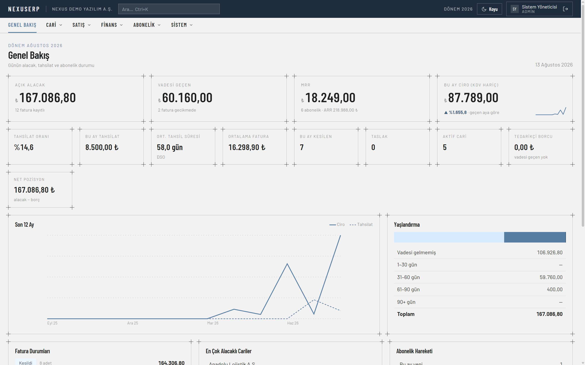

### Canlı sistem testi

37 kontrolün tamamı gerçek veri tabanı üzerinde çalıştırıldı. Her satırda sonuç,
**somut çıktı** ve kuralın neden var olduğu görünür.

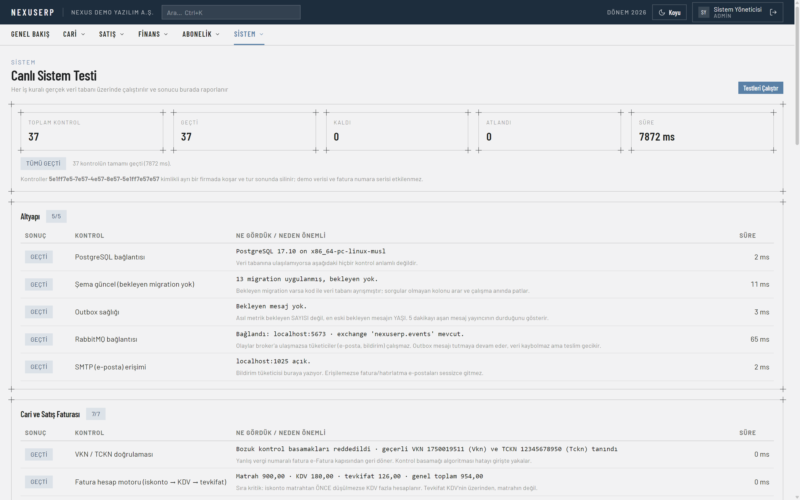

Abonelik ve kullanım bazlı faturalandırma kuralları, gerçek fatura numaraları ve
tutarlarla:

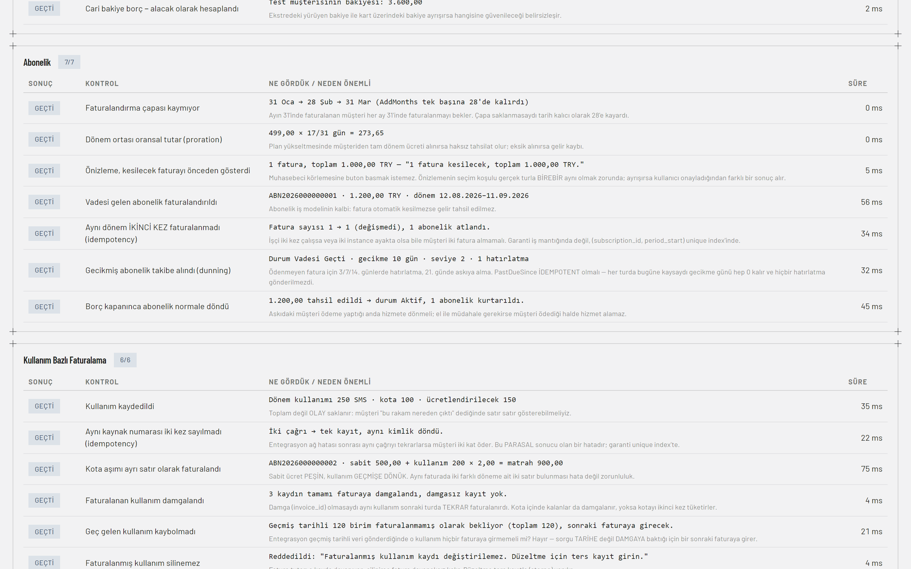

Bu iki kare tek başına şunları kanıtlıyor: çapa günü `31 Oca → 28 Şub → 31 Mar`
kaymıyor · proration `499,00 × 17/31 = 273,65` · aynı dönem ikinci kez
faturalanmıyor (`fatura sayısı 1 → 1`) · kota aşımı ayrı satır
(`sabit 500,00 + kullanım 200 × 2,00 = matrah 900,00`) · faturalanan kullanımın
tamamı damgalanıyor · geç gelen kayıt kaybolmuyor.

### Alış faturası

Tip "Alış" seçilince cari kutusu **tedarikçi** arar ve **Tedarikçi Fatura No**
alanı zorunlu olur. Numara bizim serimizden verilmez — tedarikçinin belgesinden
gelir, `Sequence` ilerlemez.

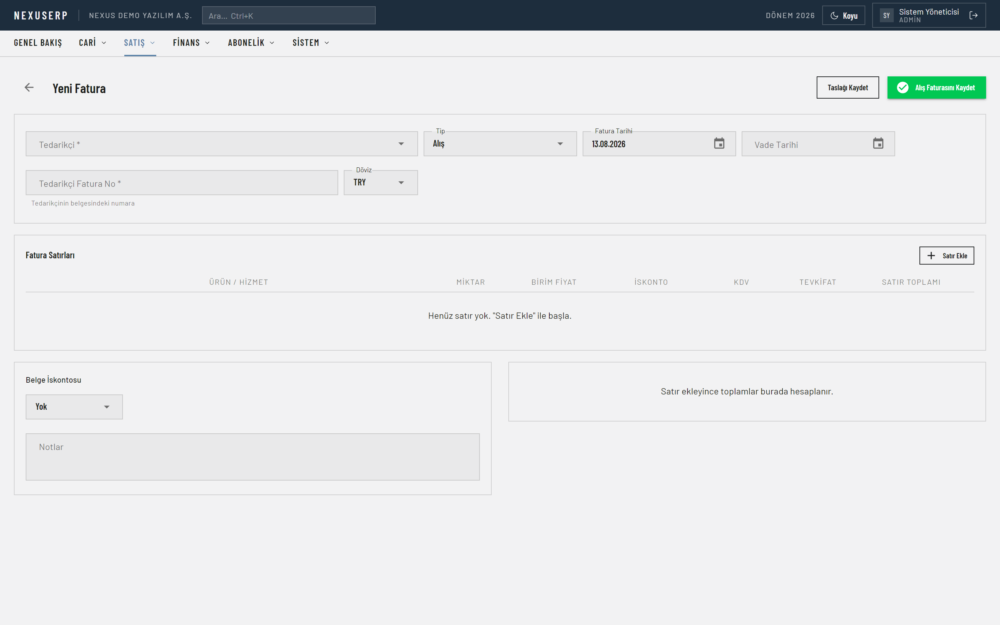

### Abonelik planları

Sabit ücretli, **sabit + kullanım** (hibrit) ve **saf kullanım** planları bir arada.
Saf kullanım planının MRR katkısı `0,00 ₺` — taahhüt edilmiş yinelenen gelir yoktur,
tutar her ay kullanımla değişir.

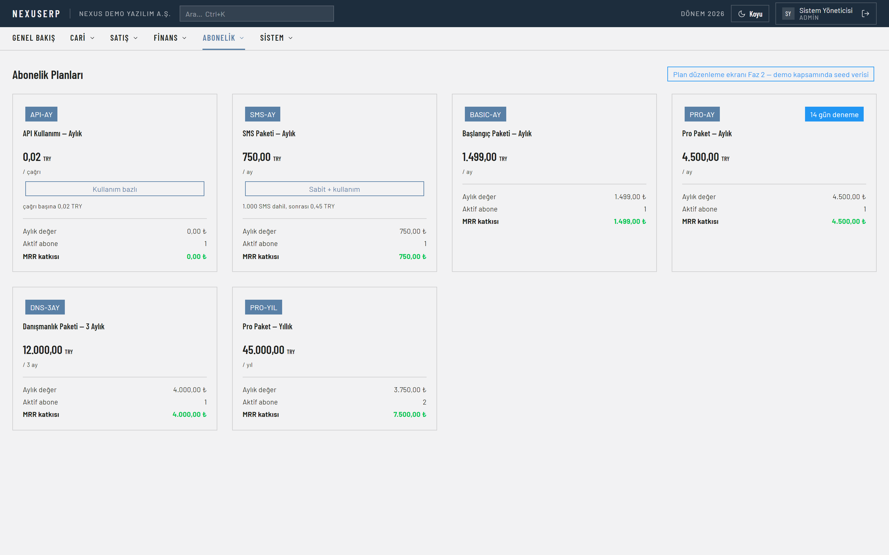

### Kullanıcı ve yetki yönetimi

Rol ataması, hesap durumu, son giriş ve parola sıfırlama. Kullanıcılar silinmez,
pasifleştirilir: denetim kayıtları ve belgelerdeki "oluşturan / değiştiren" bilgisi
onlara atıfta bulunur.

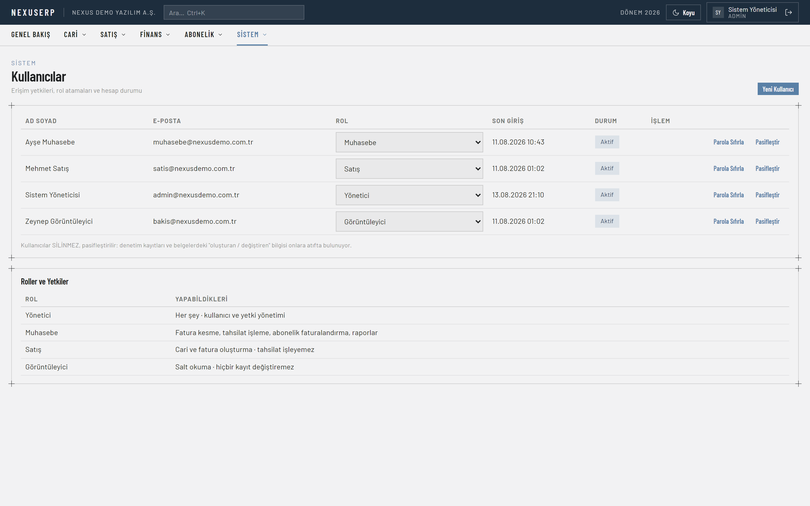

### Diğer ekranlar

| | |
|---|---|
| 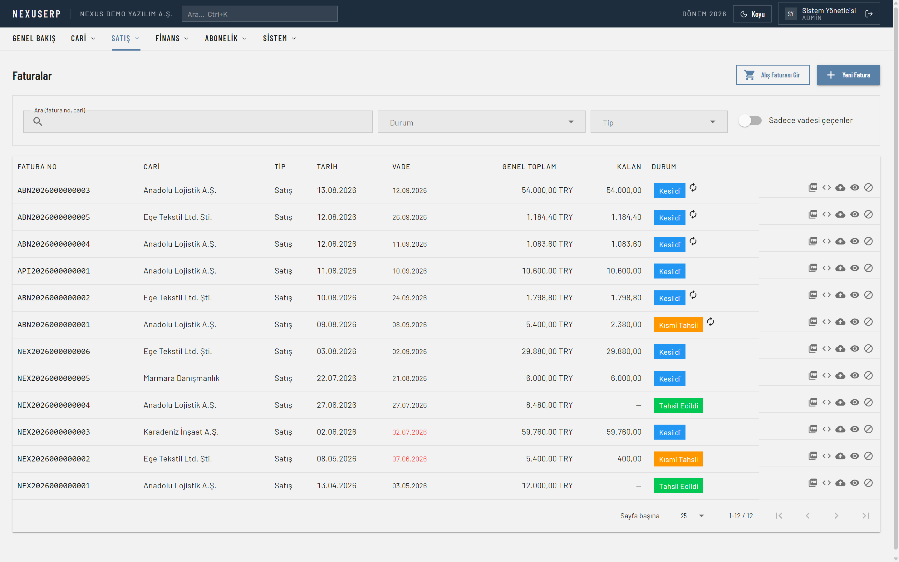 | 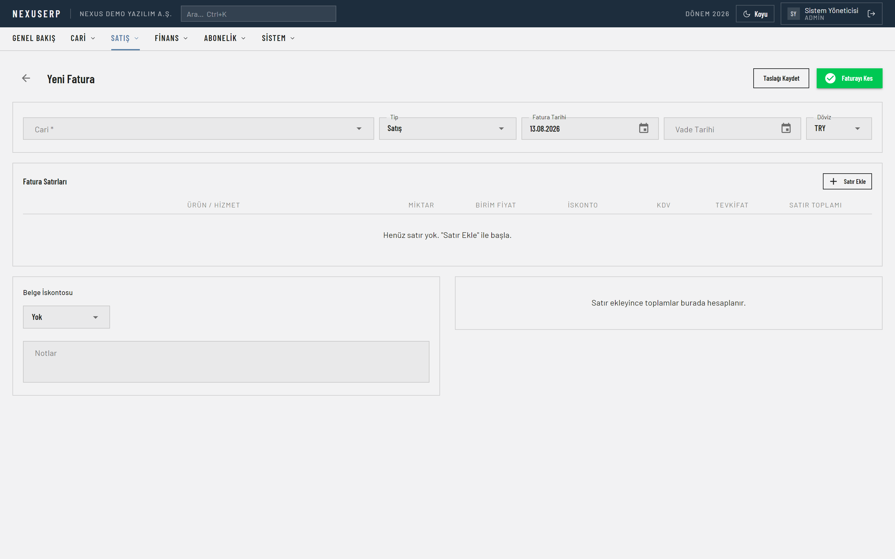 |
| **Fatura listesi** — durum, tip ve vade filtreleri | **Fatura editörü** — canlı KDV/tevkifat önizlemesi |
| 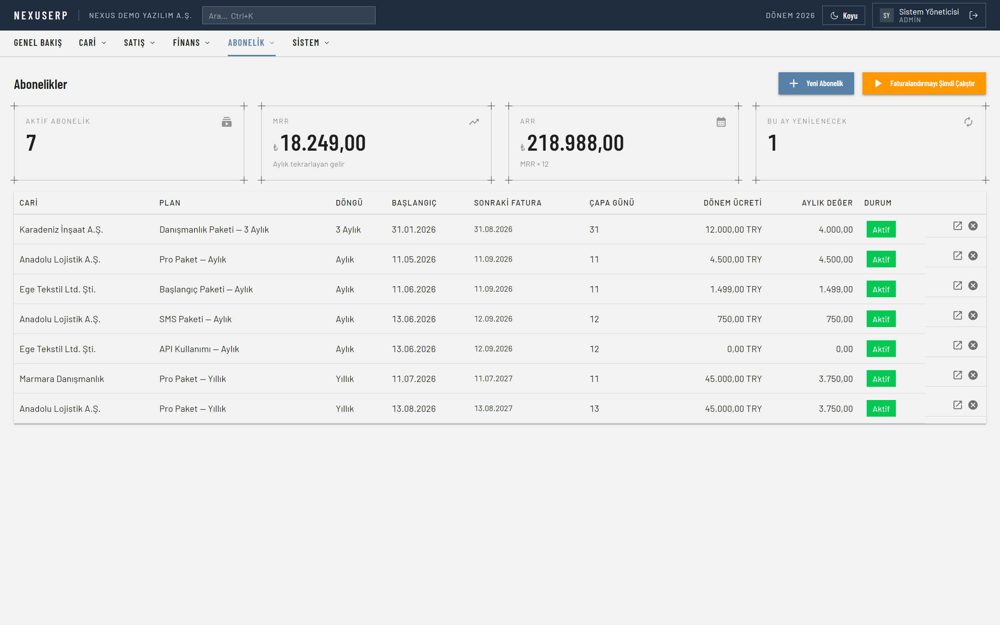 | 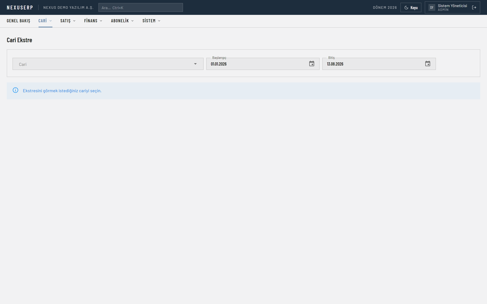 |
| **Abonelikler** — MRR, yenileme takvimi, toplu faturalandırma | **Cari ekstre** — yürüyen bakiyeli hareket dökümü |
| 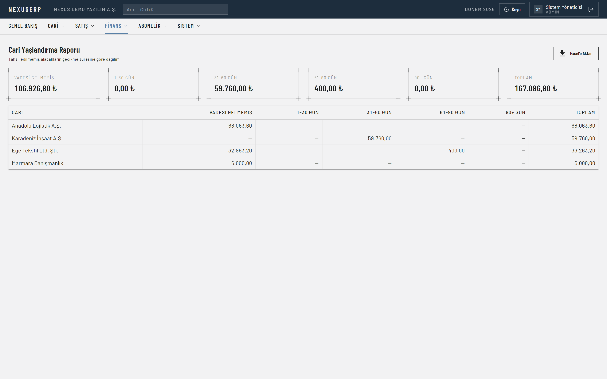 | 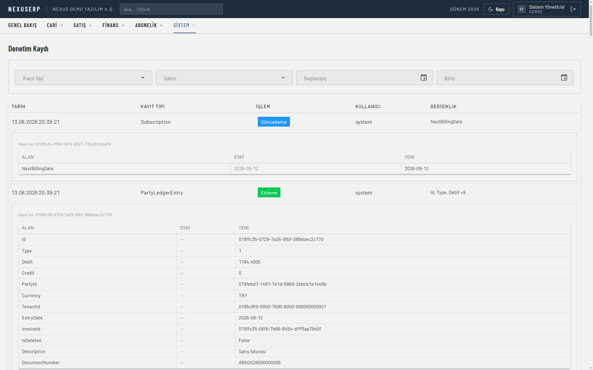 |
| **Yaşlandırma raporu** — 30/60/90 gün kovaları | **Denetim kaydı** — kim, ne zaman, hangi alanı neyden neye |
| 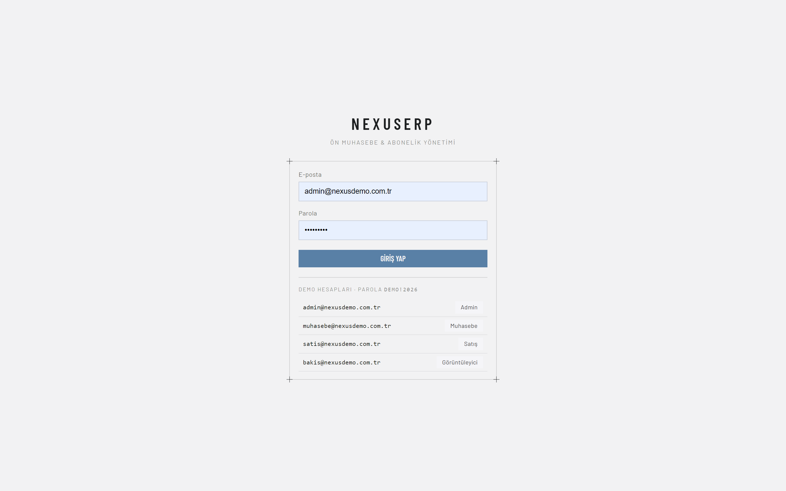 | |
| **Giriş** — demo hesapları ekranda listeli | |

---

## Kurulum

### Gereksinimler

| Araç | Sürüm | Not |
|---|---|---|
| .NET SDK | 9.0+ | `dotnet --version` |
| Docker Desktop | güncel | PostgreSQL, RabbitMQ ve MailHog için |
| RAM | ~4 GB boş | Dört container + uygulama |

Ayrıca veri tabanı kurmanıza, connection string düzenlemenize veya migration
çalıştırmanıza **gerek yok** — hepsi otomatik.

### 1. Altyapıyı başlat

```bash
docker compose up -d
```

Dört container ayağa kalkar:

| Servis | Container | Port | Arayüz |
|---|---|---|---|
| PostgreSQL 17 | `nexuserp-db` | **5433** | — |
| pgAdmin | `nexuserp-pgadmin` | 5050 | http://localhost:5050 |
| RabbitMQ | `nexuserp-mq` | **5673** / 15673 | http://localhost:15673 |
| MailHog (sahte SMTP) | `nexuserp-mail` | 1025 / 8025 | http://localhost:8025 |

> **Portlar neden standart değil?** PostgreSQL 5433'te, RabbitMQ 5673'te.
> Makinenizde yerel kurulu bir PostgreSQL veya RabbitMQ varsa standart portlar
> dolu olur; uygulama sessizce **yanlış sunucuya** bağlanır ve teşhisi zor bir
> `ACCESS_REFUSED` hatası alırsınız. Bu proje geliştirilirken tam olarak bu oldu.

PostgreSQL'in hazır olmasını bekleyin (ilk açılışta ~10 sn):

```bash
docker compose ps
```

`nexuserp-db` satırında `(healthy)` görene kadar bekleyin.

### 2. Uygulamayı çalıştır

```bash
dotnet run --project src/NexusErp.Web
```

→ **http://localhost:5283**

İlk açılışta sırayla şunlar olur:

1. Migration'lar uygulanır (şema sıfırdan kurulur)
2. Demo verisi üretilir: 5 cari, 4 ürün, 6 abonelik planı, faturalar, tahsilatlar,
   kullanım kayıtları
3. Dört demo kullanıcısı ve roller oluşturulur
4. Arka plan işçileri başlar (abonelik faturalandırma, outbox yayıncısı, dunning,
   bildirim tüketicisi, outbox temizliği)

Konsolda `Now listening on: http://localhost:5283` satırını görünce hazırdır.

### 3. (İsteğe bağlı) REST API

```bash
dotnet run --project src/NexusErp.Api
```

→ http://localhost:5299/scalar/v1 — interaktif dokümantasyon.

### Her şeyi container'da çalıştırmak

```bash
docker compose --profile full up -d --build
```

→ http://localhost:8080

### Kapatma

```bash
docker compose down          # container'ları durdur, veriyi KORU
docker compose down -v       # veriyi de sil (sıfırdan başlamak için)
```

### Sorun giderme

| Belirti | Sebep ve çözüm |
|---|---|
| `Npgsql...Connection refused` | PostgreSQL henüz hazır değil. `docker compose ps` ile `(healthy)` bekleyin. |
| `ACCESS_REFUSED` (RabbitMQ) | Makinede yerel RabbitMQ kurulu ve 5672'yi tutuyor olabilir. Compose 5673 kullanır; `appsettings.Development.json` içindeki URI'nin **sonunda `/` olmamalı** — sondaki eğik çizgi vhost'u boş dizge yapar, `/` değil. |
| Port 5283 dolu | `dotnet run --project src/NexusErp.Web --urls http://localhost:5400` |
| Türkçe karakterler sıralamada bozuk | PostgreSQL ICU locale ile kurulmalı. `docker compose down -v` ile volume'ü silip yeniden kurun. |
| E-posta gelmiyor | MailHog gerçekten e-posta göndermez; http://localhost:8025 adresinde gösterir. |
| Şema hatası (`column ... does not exist`) | `docker compose down -v && docker compose up -d` ile sıfırdan kurun. |

---

## Demo hesapları

Parola hepsinde: **`Demo!2026`**

| E-posta | Rol | Yetki |
|---|---|---|
| `admin@nexusdemo.com.tr` | Admin | Her şey + kullanıcı yönetimi + sistem testi |
| `muhasebe@nexusdemo.com.tr` | Muhasebe | Fatura kesme, tahsilat, abonelik, raporlar |
| `satis@nexusdemo.com.tr` | Satış | Cari ve fatura oluşturma — **tahsilat yok** |
| `bakis@nexusdemo.com.tr` | Görüntüleyici | Salt okuma |

Rol ayrımını görmek için `satis@` ile girip bir faturayı kesmeye çalışın: buton görünmez,
doğrudan URL ile denerseniz **403** alırsınız. Yetki yalnızca arayüzde gizlenmiyor,
sunucuda da uygulanıyor.

> **Not:** Bu hesaplar ve demo verisi yalnızca `Development` ortamında kurulur. Parolası
> burada yazılı bir yönetici hesabının canlıya çıkmaması için tohumlama başka ortamlarda
> çalışmaz; bilerek istenirse `Seed:DemoData=true` ile açılır. Aynı şekilde
> `appsettings.Development.json`'daki JWT imza anahtarı geliştirme dışında reddedilir —
> `Jwt__Key` ortam değişkeniyle gerçek bir anahtar verilmelidir.

---

## Fonksiyonları doğrulama

### A. Canlı sistem testi (en hızlı yol)

`admin@` ile girin → **Sistem → Sistem Testi** → *Testleri Çalıştır*.

**37 kontrol** gerçek servisler ve gerçek veri tabanı üzerinde çalışır ve her biri için
üç şey gösterilir: sonuç, **somut çıktı** (gerçek numaralar, tutarlar) ve o kuralın
neden var olduğu. Referans kurulumda tur **7,9 saniye** sürüyor ve 37/37 geçiyor
([ekran görüntüsü](#canlı-sistem-testi)).

> Kontroller **ayrı bir firmada (tenant)** koşar ve tur sonunda silinir. Sebebi:
> fatura kesmek numara tüketir; demo firmasında koşsaydı her tur GİB'e bildirilecek
> seride boşluk açardı. Demo veriniz ve numara seriniz etkilenmez.

Kapsanan alanlar:

| Alan | Doğrulanan davranış |
|---|---|
| Altyapı | PostgreSQL, şema güncelliği, outbox sağlığı, RabbitMQ, SMTP |
| Cari & satış faturası | VKN/TCKN kontrol basamağı · iskonto → KDV → tevkifat sırası · boşluksuz numara serisi · kesilen faturanın değişmezliği · cari borç yönü |
| Alış faturası | Numara tedarikçiden gelir, kendi serimiz tüketilmez · cari yönü satışın tersi · mükerrer tedarikçi faturası reddi |
| Tahsilat | FIFO dağıtım · fatura durumu · cari bakiye |
| Abonelik | Çapa günü kaymaz · oransal tutar · faturalandırma önizlemesi · aynı dönem iki kez faturalanmaz · dunning ve normale dönüş |
| Kullanım bazlı | Kota aşımı · kaynak numarası idempotency · damgalama · geç gelen kayıt |
| Muhasebe | Hesap planı · fatura ve tahsilattan otomatik fiş · dengesiz fiş reddi · mükerrer fiş engeli · mizan denk mi · bilanço aktif = pasif · gelir tablosu tutarlılığı |
| Mesajlaşma | Outbox'a yazma ve broker'a yayınlanma |
| Kullanıcı & yetki | Firma izolasyonu · rol doğrulaması · denetim kaydı |

### B. Elle demo senaryosu

Sistem testinin otomatik doğruladığı şeyleri arayüzde adım adım görmek isterseniz:

**1 · Fatura kes ve numaranın sırayla verildiğini gör**
`Satış → Yeni Fatura` → cari seç, satır ekle → *Taslağı Kaydet*.
Fatura numarası **yok** (taslak). *Faturayı Kes* → `NEX2026...` numarası atanır.
Bir tane daha kesin: numara birer artar, boşluk yoktur.

**2 · Kesilen fatura değişmiyor**
Kestiğiniz faturayı açın: alanlar salt okunur, "Kesildi" etiketi görünür.

**3 · Alış faturası — numara tedarikçiden gelir**
`Faturalar → Alış Faturası Gir`. Cari kutusu artık **tedarikçi** arar.
"Tedarikçi Fatura No" alanına `TED-001` yazıp kaydedin.
Fatura numarası girdiğiniz değerdir — kendi seriniz tüketilmez.
Aynı tedarikçiye aynı numarayı ikinci kez girmeye çalışın: **reddedilir**.
`Cari → Cari Ekstre` ile tedarikçiyi seçin: hareket **alacak** tarafında
(satışta borç, alışta alacak).

**4 · Tahsilat FIFO dağıtılıyor**
`Finans → Tahsilatlar → Yeni Tahsilat` → cari seç, tutar gir, *otomatik dağıt* açık.
En eski vadeli fatura önce kapanır; fatura durumu "Tahsil Edildi"ye döner.

**5 · Abonelik faturalandırma ve önizleme**
`Abonelik → Abonelikler → Şimdi Faturalandır`. Önce **önizleme** açılır: hangi cariye,
hangi dönem, ne kadar. Onaylayın. Aynı butona tekrar basın: ikinci fatura **üretilmez**
("zaten faturalanmış olduğu için atlanacak").

**6 · Kullanım bazlı faturalandırma**
`Abonelik → Planlar` sayfasında **SMS Paketi** (sabit + kullanım) ve
**API Kullanımı** (saf kullanım) planlarını görün.
Bu planlara bağlı bir aboneliği açın → **Kullanım** paneli:
dönem kullanımı, kalan ücretsiz kota, tahmini tutar.
Kullanım ekleyin, sonra faturalandırın: kota aşımı **ayrı satır** olarak faturaya girer.
Faturada sabit ücret satırı gelecek dönemi, kullanım satırı **geçmiş** dönemi kapsar —
bir dönemin kullanımı ancak dönem bittiğinde bilinir.

**7 · Ödeme takibi (dunning)**
Vadesi geçmiş abonelik faturası olan cari `Gecikmiş` durumuna geçer.
3/7/14. günlerde hatırlatma e-postası, 21. günde askıya alma.
E-postaları http://localhost:8025 (MailHog) adresinde görün.
Borç kapanınca abonelik otomatik normale döner.

**8 · Outbox → RabbitMQ → e-posta zinciri**
Fatura kestikten sonra:
- http://localhost:15673 (`nexus` / `nexus_dev_2026`) → mesaj kuyrukta
- http://localhost:8025 → müşteriye giden e-posta
- http://localhost:5283/saglik → outbox sağlık durumu (JSON)

RabbitMQ'yu durdurup (`docker stop nexuserp-mq`) fatura kesin: fatura **kesilir**,
mesaj outbox'ta bekler, `attempt_count` artar. Broker'ı geri açın: mesaj yayınlanır.
Hiçbir veri kaybolmaz.

**9 · Çift taraflı muhasebe — fiş, mizan, bilanço**
`Muhasebe → Muhasebe Fişleri`: kestiğiniz her fatura ve işlediğiniz her tahsilat için
**otomatik fiş** üretilmiştir. Satış faturasının fişini açın:
`120 Alıcılar` borç / `600 Yurtiçi Satışlar` + `391 Hesaplanan KDV` alacak.
Alış faturasının fişinde yön terstir: `153`+`191` borç / `320 Satıcılar` alacak.

`Muhasebe → Yeni Fiş` ile elle fiş girin (örn. `770 Genel Yönetim Gideri` borç /
`100 Kasa` alacak). Borç ve alacak toplamı eşit değilken **Kesinleştir** butonu açılmaz;
zorlarsanız sunucu da reddeder — dengesiz fiş veri tabanına yazılamaz (CHECK constraint).

`Muhasebe → Mizan`: borç toplamı = alacak toplamı, en üstte yeşil rozetle doğrulanır.
`Muhasebe → Bilanço`: aktif = pasif (dönem kâr/zararı pasife dahil).
`Muhasebe → Gelir Tablosu`: gelir − gider = dönem net sonucu; bilançodaki dönem kârıyla
birebir aynı çıkar.

**10 · Kullanıcı ve yetki yönetimi**
`Sistem → Kullanıcılar` (yalnızca Admin). Kullanıcı açın — parola otomatik üretilir ve
**bir kez** gösterilir. Rol değiştirin, pasifleştirin.
Kendi hesabınızı pasifleştirmeyi deneyin: engellenir.
Son yöneticiyi düşürmeyi deneyin: engellenir.

**11 · Denetim kaydı**
`Sistem → Denetim Kaydı`: yaptığınız her değişiklik kim/ne zaman/hangi alan/eski değer/yeni
değer olarak listelenir.

**11 · Belge çıktıları**
Fatura listesinde bir faturanın satır sonundaki menüden **PDF**, **UBL-TR XML** ve
**Excel** çıktısı alın.

---

## Neler var

**Ön muhasebe.** Cari kartlar (müşteri/tedarikçi, VKN-TCKN doğrulamalı), ürün/hizmet
kataloğu, KDV oranları, satış ve **alış** faturası, iade, proforma, tahsilat ve FIFO
eşleştirme, cari hesap defteri, 30/60/90 gün yaşlandırma raporu.

**Çift taraflı muhasebe.** Tek Düzen Hesap Planı (hiyerarşik, işletme kendi alt hesabını
açabilir), muhasebe fişi (taslak/kesinleşmiş, dengesiz fiş kesinleştirilemez), satış ve
alış faturasından + tahsilattan **otomatik fiş** üretimi (belgeyle aynı transaction'da,
mükerrer kayıt veri tabanı seviyesinde engelli), tevkifatlı fatura desteği, mizan,
bilanço ve gelir tablosu.

**Abonelik ve faturalandırma.** Planlar (aylık/3 aylık/6 aylık/yıllık), deneme süresi,
oransal plan değişikliği, duraklat/sürdür/iptal, iptal sebebi ve churn analizi, MRR/ARR,
otomatik dönemsel faturalandırma, toplu faturalandırma önizlemesi, ödeme takibi.

**Kullanım bazlı faturalandırma.** Sabit / kullanım bazlı / hibrit planlar, ücretsiz kota,
aşım fiyatı, olay bazlı kullanım kaydı, entegrasyon için idempotent REST ucu.

**Altyapı.** Outbox pattern + RabbitMQ, at-least-once teslim, tüketici idempotency defteri,
DLQ, e-posta bildirimi, denetim kaydı, sağlık ucu, arka plan işçileri.

**Belgeler.** Fatura PDF (QuestPDF), UBL-TR 1.2 e-Fatura XML, formüllü Excel çıktısı.

---

## Mimari

```
NexusErp.Web (Blazor) ─┐
                       ├─→ Infrastructure ─→ Application ─→ Domain
NexusErp.Api (REST)  ──┘      EF Core          servisler      iş kuralları
                              PostgreSQL       DTO'lar        NuGet bağımlılığı YOK
                              RabbitMQ
```

Bağımlılık yönü tek: dışarıdan içeri. Web ve API **aynı** Application servislerini kullanır;
aralarındaki tek fark kimlik kaynağıdır (çerez vs JWT).

| Karar | Gerekçe |
|---|---|
| MediatR yok | v13+ ticari lisans; düz servisle stack trace okunabilir kalıyor |
| Repository yok | `DbSet<T>` zaten repository, `DbContext` zaten Unit of Work |
| `decimal(18,4)` + `AwayFromZero` | .NET varsayılanı banker's rounding, faturada kuruş farkı yapar |
| Soft delete + partial unique index | Muhasebe verisi silinmez; silinmiş kayıt index'i işgal etmemeli |
| `IDbContextFactory` | Blazor'da scoped servis devre ömrü boyunca yaşar; her işlem taze context açar |
| Outbox + RabbitMQ | Olay doğrudan gönderilseydi gönderim hatasında fatura kesilir ama kimse haberdar olmazdı |

---

## Teknik olarak kayda değer kısımlar

**KDV / tevkifat / iskonto motoru.** Satır bazlı yuvarlama (GİB standardı) ve kuruş kaybı
olmayan orantısal belge iskontosu dağıtımı: 100 TL üç satıra bölünürken
`33,33 × 3 = 99,99` değil, tam `100,00`. Motor Domain'de saf fonksiyon olduğu için
arayüzdeki canlı önizleme ile sunucudaki kayıt **aynı kodu** çağırır; iki hesap ayrışamaz.

**Atomik fatura numaralandırma.** `INSERT ... ON CONFLICT ... RETURNING` ile tek ifadede.
50 paralel istekte çakışmasız ve boşluksuz seri — testle kanıtlı.
`SELECT MAX(no)+1` yarış koşuluna açıktır.

**Alış faturasında numara üretilmez.** Numara tedarikçinin belgesinden gelir; kendi
serimizden numara verseydik GİB'e bildirdiğimiz satış serisinde boşluk açardık.
Mükerrer giriş `(tenant, cari, tedarikçi_fatura_no)` unique index'iyle engellenir —
el ile veri girişinde en sık yapılan hata budur ve hem cariyi hem gideri şişirir.

**Idempotent abonelik faturalandırma.** Aynı abonelik + aynı dönem için ikinci fatura
üretilmez. Garanti iş mantığında değil `(subscription_id, period_start)` unique index'inde:
yarış koşulunda uygulama katmanı yanılır, veri tabanı kısıtı yanılmaz.

**"Ayın son günü" problemi.** 31 Ocak'ta başlayan aylık abonelik:
31 Oca → 28 Şub → **31 Mar** (28 Mar değil). Çapa günü ayrı saklanır;
`AddMonths` tek başına günü kalıcı kaydırır.

**Kullanım: tarihe değil damgaya göre faturalandırma.** Faturalanacak kullanım
"şu dönemin kayıtları" diye seçilseydi, entegrasyonun bir gün geç gönderdiği kullanım
hiçbir faturaya girmezdi. Kayıtlar faturaya damgalanır (`invoice_id`); damga tek doğruluk
kaynağıdır. Kota içinde kalıp ücretlendirilmeyenler de damgalanır — yoksa sonraki turda
kotayı ikinci kez tüketirler.

**Sabit ücret peşin, kullanım geçmişe dönük.** Hibrit bir faturada iki farklı döneme ait
iki satır bulunur; bu hata değil zorunluluktur — bir dönemin kullanımı ancak dönem
bittiğinde bilinir.

**Outbox pattern.** Olay, fatura ile **aynı transaction'da** yazılır: ikisi ya birlikte
olur ya hiç olmaz. Yayıncı `FOR UPDATE SKIP LOCKED` kullanır, birden fazla instance
güvenle çalışır. Teslim at-least-once; tüketici tarafında `(tüketici, mesaj_id)` unique
index'li idempotency defteri aynı mesajın iki kez işlenmesini engeller.

**Tenant izolasyonu.** EF Core global query filter, reflection ile tüm `ITenantScoped`
entity'lere merkezî uygulanır. **İstisna:** ASP.NET Identity kullanıcıları bu arayüzü
uygulamaz, filtre onlara işlemez — kullanıcı yönetimindeki her sorguya tenant filtresi
elle eklenir ve bu davranış ayrıca test edilir.

**Denetim kaydı.** Her değişiklik `SaveChanges` üzerinden JSON olarak yazılır: kim,
ne zaman, hangi alanı neyden neye çevirdi.

**e-Fatura (UBL-TR 1.2).** GİB formatında XML: `CustomizationID=TR1.2`, ETTN, KDV oranı
bazında ayrı `TaxSubtotal`, tevkifat için `WithholdingTaxTotal`, UN/ECE Rec.20 birim
kodları. Entegratör bağlantısı `IEInvoiceGateway` arkasında.

---

## Test

```bash
dotnet test
```

**233 test.** Hesaplama motoru saf birim testleriyle (milisaniyeler), servisler
**Testcontainers** üzerinde gerçek PostgreSQL ile. InMemory sağlayıcı kullanılmadı —
partial index, ICU sıralaması ve precision davranışını taklit edemez; testler geçer,
üretimde patlar.

> Testler Docker gerektirir; Testcontainers her koşuda geçici bir PostgreSQL başlatır.

Öne çıkanlar: 50 paralel istekte numara çakışması olmadığı · bir tenant'ın diğerinin
verisini göremediği · aynı dönem için ikinci abonelik faturası üretilmediği · belge
iskontosunda kuruş kaybı olmadığı · aynı kullanımın iki kez faturalanmadığı · son
yöneticinin rolden düşürülemediği.

Sistem testi ekranının kendisi de test edilir: demoda "her şey yeşil" gösteren bir ekran,
kontrollerden biri sessizce hiçbir şey doğrulamaz hale geldiğinde **yalan söyler** —
sahte güven, hiç test olmamasından daha kötüdür.

---

## REST API

```bash
dotnet run --project src/NexusErp.Api
```

→ http://localhost:5299/scalar/v1

JWT kimlik doğrulama, rol bazlı yetki, hız sınırlama. Application katmanına **hiç
dokunmadan** eklendi. Yetki API'de de geçerli: Satış rolüyle
`POST /api/faturalar/{id}/kes` → **403**.

Başlıca uçlar: `/api/auth/token` · `/api/cariler` · `/api/faturalar` (+ `/kes`, `/pdf`,
`/ubl`) · `/api/tahsilatlar` (+ `/yaslandirma`) · `/api/abonelikler/faturalandir`
(idempotent) · `/api/abonelikler/{id}/kullanim` (kullanım kaydı — `kaynakNo` gönderilirse
idempotent; entegrasyonun yeniden denemesi müşteriye fazladan fatura çıkarmaz).

---

## Performans

100.000 fatura / 500 cari ile: yaşlandırma raporu **80 ms** (`Seq Scan` + `HashAggregate`),
tek carinin açık faturaları **2 ms** (`Bitmap Index Scan`).

Hipotez yaşlandırma raporuna kapsayıcı index eklemenin hızlandıracağıydı; ölçüm anlamlı
fark göstermedi. Sorguda seçici filtre yok, tablonun tamamı okunuyor — index okumayı
hızlandırmaz, yalnızca yazma maliyetini artırır. **Karar: index eklenmedi.**

```bash
dotnet test --filter FullyQualifiedName~AgingReportBenchmark
```

---

## Kapsam dışı

Stok/depo yönetimi, kasa-banka hesap takibi ve banka ekstresi mutabakatı, çek/senet
portföyü, duran varlık ve amortisman, çoklu döviz ve kur farkı hesaplaması, KDV
beyannamesi, dönem sonu kapanış işlemleri, gerçek entegratör bağlantısı (UBL-TR XML
üretimi hazır, bağlantı değil), plan düzenleme ekranı (planlar tohum verisiyle gelir).

Amaç genişlik değil derinlikti: faturalandırma ve abonelik motoru üretim kalitesinde
yazıldı.

---

## Lisans

Bu yazılım **tescilli ve tüm hakları saklıdır**. Kaynak kodun herkese açık olması
herhangi bir kullanım hakkı tanımaz.

Kopyalama, değiştirme, dağıtım, ticari kullanım, alt lisanslama, tersine mühendislik
ve yapay zeka eğitim verisi olarak kullanım **açıkça yasaklanmıştır**.

Ayrıntılar için [LICENSE](LICENSE) dosyasına bakınız.

© 2026 Ahmet Yıldırım. Tüm hakları saklıdır.
